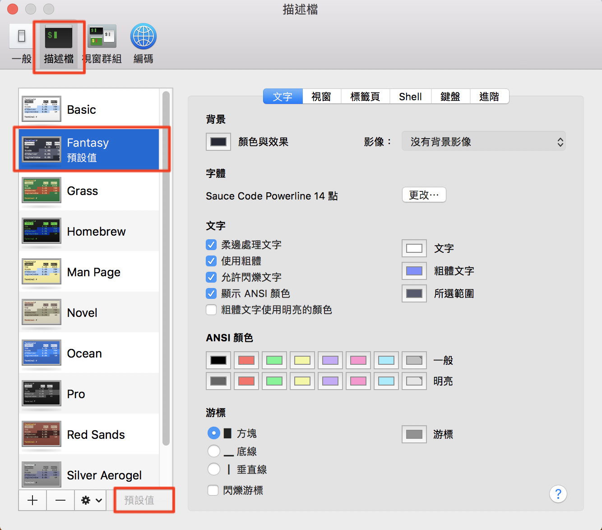

# iTerm2 + zsh


### STEP1 安裝 Homebrew


Homebrew 是 Mac OSX 上的的套件管理工具，是方便安裝管理 OSX 裡需要用到但預設沒安裝的套件。

Homebrew 的安裝只需要打開終端機，輸入：

```bash
$ /usr/bin/ruby -e "$(curl -fsSL https://raw.githubusercontent.com/Homebrew/install/master/install)"
```

就可以了。接著可以輸入以下指令確認是否有安裝成功：

```bash
$ brew --version
```

### STEP2 安裝 iTerm2

iTerm2 是一個可以用來取代 MAC 原生終端機的工具，擁有許多更方便的功能和特色，只需到官網下載安裝就可以了。

2.1. [主程式下載](./files/iTerm2-3_1_5.zip)

2.2. [主題下載](./files/Fantasy.itermcolors)

2.3. 套用 iTerm 的配色

下載並點擊後就會自動匯 iTerm 當中。

然後打開 iTerm，進入以下路徑 iterm --> preference --> profiles --> colors --> Color Presets --> Fatansy


### STEP3 安裝 ZSH

ZSH 是用來取代 BASH 的一種工具，打開 Terminal 輸入：

```bash
$ brew install zsh zsh-completions
```

透過以下程式碼可以確認是否安裝成功：

```bash
$ zsh --version
```

預設終端機窗口改為 ZSH

將ZSH加入到設定白名單

```bash
$ sudo vim /etc/shells
```

最下面加入

```bash
/usr/local/bin/zsh
```

將 Shell 預設窗口從 BASH 改成 ZSH，只需在終端機輸入：

```bash
$ chsh -s $(which zsh)
```

接著關閉 Terminal 後再次開啟，確認是否更改成功，輸入：

```bash
$ echo $SHELL
```

如果成功更改的話，應該會出現 /usr/local/bin/zsh


### STEP4 安裝 Oh My ZSH

Oh My Zsh 是一個用來管理 ZSH 設定檔（configuration）的框架，提供了很多的外掛（plugin）和主題（theme）可以選擇。

要安裝 Oh My Zsh 只需在終端機輸入：

```bash
$ sh -c "$(curl -fsSL https://raw.github.com/robbyrussell/oh-my-zsh/master/tools/install.sh)"
```

使用 Oh My Zsh

接下來我們要套用主題，一樣在終端機輸入：

```bash
$ open ~/.zshrc
```

接著會打開 zsh 的設定檔，找到 ZSH_THEME=”…”，將這段的內容直接替換成

```bash
ZSH_THEME="agnoster"
```

之後 cmd + s 存檔


### 套用字體 SourceCodePro

在安裝的過程中，如果你發現出現一些看不懂的文字或亂碼時，很可能是因為沒有相對應的字體，因此我們要下載字體。

[下載字體檔-SourceCodePro](./files/SourceCodePro.zip)

在 iTerm2 中套用字體（Meslo）：iTerm -> Preferences -> Profiles -> Text -> Change Font -> Source Code Pro for Powerline


終端機也相同需要設定字型


### 其他外掛或建議


Auto suggestions (for Oh My Zsh)

在終端機輸入：

```bash
$ git clone git://github.com/zsh-users/zsh-autosuggestions $ZSH_CUSTOM/plugins/zsh-autosuggestions
```

打開 ZSH 設定檔：

```bash
$ open ~/.zshrc
```

找到 plugins = “” 的地方，在 plugins 的欄位中加入”zsh-autosuggestion”後存檔：

```bash
# 原本
plugins=(git)
# 改成
plugins=(git zsh-autosuggestions)
```
有時候你的背景色和提是的文字會太過接近，以致於你看不到 autosuggestions 的文字，這時候需要去設定顯示的文字。一樣先在終端機輸入以下文字，以開啟設定檔：

```
$ vim $ZSH_CUSTOM/plugins/zsh-autosuggestions/zsh-autosuggestions.zsh
```

打開設定檔後，在文件中找到這行（預設會是 fg=8），這就是給終端機所使用的256色碼，你可以改成自己喜歡的顏色，這裡我用 fg=240 感覺比較合適。

```bash
# 原本
ZSH_AUTOSUGGEST_HIGHLIGHT_STYLE='fg=8'
# 改成
ZSH_AUTOSUGGEST_HIGHLIGHT_STYLE='fg=240'
```

接著，只要你輸入過相關的文字，下次再次打入同樣的文字的時候，就會產生自動建議的文字，按下→後就會自動帶入，像是這樣的效果：


### 客制化 prompt

在終端機中預設的 prompt 會是”user@hostname”，非常長一串，我們可以透過以下的方式讓那一長串不要顯示出來。

打開 ZSH 設定檔：

```
$ open ~/.zshrc
```

找個地方加入下面這段，DEFAULT_USER 中 “yourname” 要填的是你使用者的名稱，如果不知道使用者的名稱的話，可以在終端機輸入 whoami 查看


`# optionally set DEFAULT_USER in ~/.zshrc to your regular username to hide the “user@hostname” info when you’re logged in as yourself on your local machine.`

```
DEFAULT_USER=yourname
```

### 程式碼高亮

在終端機輸入下面這段，下載 Syntax Highlighting：

```
$ brew install zsh-syntax-highlighting
```

接著一樣打開 ZSH 設定檔：

```
$ open ~/.zshrc
```

在設定檔的最下面加上這段

```
$ source /usr/local/share/zsh-syntax-highlighting/zsh-syntax-highlighting.zsh
```


### Atom(IDE) Package Setting

打開 atom

按下 cmd+,

進入以下路徑 packages --> platformio-ide-terminal --> settngs

- Shell Override: /usr/local/bin/zsh

- Font Format: Source Code Pro for Powerline

- Theme: one-dark

### VSCode(IDE) Terminal Setting

```json
{
   "terminal.integrated.fontFamily": "Source Code Pro for Powerline",
}
```


### 你可以修改原本的 terminal 的 style

[下載主題](./files/Fantasy.terminal)

開啟套用




## 參考文件
1.[為 MAC 的 Terminal 上色 - 透過 iTerm 2 和 Oh My Zsh 高亮你的終端機(PJCHENder
那些沒告訴你的小細節)](https://pjchender.blogspot.tw/2017/02/mac-terminal-iterm-2-oh-my-zsh.html)

2.[讓終端更美麗動人-解決亂碼問題(回風.me)](
http://huifeng.me/2015/08/25/Made-iTerm2-lovely-and-amazing/)
